# 👋 Hey there! I'm Amit Kanjariya

<div align="center">
  
```ascii
     ╔═══════════════════════════════════════╗
     ║  🚀 Full-Stack Developer & Innovator  ║
     ║  📱 Mobile App Enthusiast             ║
     ║  💡 Problem Solver Extraordinaire     ║
     ╚═══════════════════════════════════════╝
```

</div>

## 🎯 About Me

I'm a passionate developer who loves crafting digital solutions that make a real impact. From mobile apps to web platforms, I enjoy the entire journey from concept to deployment. My code is my canvas, and every project tells a story of innovation and persistence.

```typescript
const amit = {
  pronouns: "he/him",
  location: "Gujarat, India 🇮🇳",
  currentFocus: ["Mobile Development", "Web Applications", "Backend Systems"],
  mindset: "Always learning, always building",
  funFact: "I debug with coffee and deploy with confidence ☕"
};
```

## 🛠️ Tech Arsenal

<div align="center">

### 📱 Mobile Development


### 🌐 Web Development


### 🗄️ Backend & Database


</div>

## 🚀 Featured Projects

<div align="center">

| Project | Description | Tech Stack | Status |
|---------|-------------|------------|--------|
| 💰 **Cash-In-Out** | Financial management system with mobile app & backend | `Dart` `PHP` | 🚀 Active |
| 💬 **ChatZilla** | Real-time chat application | `TypeScript` | 🔥 Featured |
| 🛒 **reBazzar** | E-commerce platform | `Kotlin` | 📱 Mobile-First |
| 📰 **NewsApp** | News reader with NewsAPI integration | `Kotlin` | 📖 Reader |
| 🧵 **ThreadSphere** | Social networking platform | `TypeScript` | 🌐 Social |

</div>

## 📊 GitHub Analytics

<div align="center">
  


</div>

<div align="center">
  
[](https://git.io/streak-stats)

</div>

## 🎨 What I'm Building

```mermaid
graph LR
    A[💡 Idea] --> B[🎯 Planning]
    B --> C[⚡ Development]
    C --> D[🧪 Testing]
    D --> E[🚀 Deployment]
    E --> F[📈 Scaling]
    F --> A
```



I believe in the power of iterative development and continuous improvement. Each project is an opportunity to learn something new and push the boundaries of what's possible.

## 🌟 Development Philosophy

> "Code is like humor. When you have to explain it, it's bad." - Cory House

- 🎯 **User-Centric**: Every line of code serves the end user
- 🔧 **Clean Architecture**: Maintainable, scalable, and robust solutions
- 🚀 **Performance First**: Optimized for speed and efficiency
- 📱 **Mobile-First**: Responsive design that works everywhere
- 🔄 **Continuous Learning**: Staying updated with the latest tech trends

## 📈 Current Focus

```yaml
Learning:
  - Advanced Flutter animations
  - Microservices architecture
  - Cloud-native development
  - AI/ML integration in mobile apps

Building:
  - Cross-platform mobile solutions
  - Scalable backend systems
  - Real-time applications
  - Financial technology platforms
```

## 🤝 Let's Connect!

<div align="center">

I'm always excited to collaborate on innovative projects and connect with fellow developers. Whether you have an idea, want to contribute to my projects, or just want to chat about tech, feel free to reach out!

[](https://linkedin.com/in/amitkanjariya)
[](https://twitter.com/amitkanjariya)
[](mailto:amit.kanjariya@example.com)

</div>

---

<div align="center">

```
Thanks for stopping by! ⭐ Star some repositories if you find them interesting!
```


</div>
