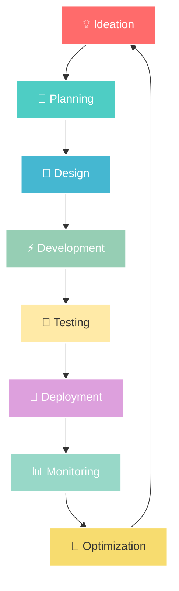

<div align="center">

#  Hey, I'm Amit Kanjariya

<div align="center">
  
</div>


</div>

---

## 🚀 About Me

```javascript
const amit = {
    pronouns: "He/Him",
    location: "Gujarat, India 🇮🇳",
    currentRole: "Full-Stack Developer",
    
    code: {
        mobile: ["Dart", "Flutter", "Kotlin", "Android"],
        frontend: ["TypeScript", "JavaScript", "React"],
        backend: ["PHP", "Node.js", "REST APIs"],
        database: ["MySQL", "SQLite", "Firebase"],
        tools: ["Git", "VS Code", "Android Studio"]
    },
    
    currentFocus: "Building scalable mobile and web applications",
    funFact: "I debug with coffee ☕ and deploy with confidence 🚀",
    
    challenge: "I'm currently exploring AI/ML integration in mobile apps",
    askMeAbout: ["Flutter", "Android", "Web Development", "System Design"],
    
    lifePhilosophy: "Code is poetry written in logic"
};
```

<br clear="both"/>

---

## 🛠️ **Technology Stack**

<div align="center">

### 📱 **Mobile Development**


### 🌐 **Web Technologies**  


### 🗄️ **Backend & Database**


### 🔧 **Tools & Platforms**


</div>

---

## 📈 **GitHub Analytics**

<div align="center">
  
  
</div>

<div align="center">
  
</div>

<div align="center">
  
</div>

---

## 🎯 **Featured Projects**

<div align="center">

<table>
<tr>
<td width="50%">

### 💰 Cash-In-Out System


**Complete financial management ecosystem**
- 📱 Flutter mobile app with intuitive UI
- 🔧 PHP backend with robust APIs
- 💳 Transaction tracking & analytics
- 🔐 Secure authentication system

</td>
<td width="50%">

### 💬 ChatZilla


**Real-time messaging platform**
- ⚡ Real-time communication
- 🎨 Modern TypeScript architecture
- 💬 Group chat functionality
- 🔔 Push notifications

</td>
</tr>
<tr>
<td width="50%">

### 🛒 reBazzar


**E-commerce platform**
- 📱 Native Android development
- 🛍️ Complete shopping experience
- 💳 Payment gateway integration
- 📊 Admin dashboard

</td>
<td width="50%">

### 📰 NewsApp


**Smart news reader**
- 📱 Kotlin-based Android app
- 🌐 NewsAPI integration
- 📖 Offline reading capability
- 🎨 Material Design UI

</td>
</tr>
</table>

</div>

---

## 🎨 **Development Workflow**

<div align="center">


```mermaid
graph TD
    A[💡 Ideation] --> B[🎯 Planning]
    B --> C[🎨 Design]
    C --> D[⚡ Development]
    D --> E[🧪 Testing]
    E --> F[🚀 Deployment]
    F --> G[📊 Monitoring]
    G --> H[🔄 Optimization]
    H --> A
    
    style A fill:#FF6B6B,stroke:#fff,stroke-width:2px,color:#fff
    style B fill:#4ECDC4,stroke:#fff,stroke-width:2px,color:#fff
    style C fill:#45B7D1,stroke:#fff,stroke-width:2px,color:#fff
    style D fill:#96CEB4,stroke:#fff,stroke-width:2px,color:#fff
    style E fill:#FFEAA7,stroke:#fff,stroke-width:2px,color:#333
    style F fill:#DDA0DD,stroke:#fff,stroke-width:2px,color:#fff
    style G fill:#98D8C8,stroke:#fff,stroke-width:2px,color:#fff
    style H fill:#F7DC6F,stroke:#fff,stroke-width:2px,color:#333
```

</div>

---

## 🌟 **My Development Philosophy**

<div align="center">

| 🎯 **Principle** | 📝 **Description** |
|:---:|:---|
| **User-Centric** | Every line of code serves the end user's needs |
| **Clean Code** | Write code that tells a story, not a puzzle |
| **Performance First** | Optimize for speed, scalability, and efficiency |
| **Mobile-First** | Design for mobile, enhance for desktop |
| **Continuous Learning** | Technology evolves, and so do I |

</div>

---

## 🚀 **Current Focus & Learning**

<div align="center">


</div>

```yaml
🎯 2024 Goals:
  ✅ Master Flutter advanced animations
  🔄 Implement microservices architecture
  📱 Build AI-integrated mobile apps
  🌐 Contribute to open-source projects
  📚 Share knowledge through tech blogs

🔥 Next Projects:
  - Real-time collaboration platform
  - AI-powered expense tracker
  - Social commerce application
  - Developer productivity tools
```

---

## 🏆 **Achievements & Recognition**

<div align="center">


</div>

---

## 🤝 **Let's Connect & Collaborate**

<div align="center">


<br><br>

[](https://linkedin.com/in/amitkanjariya)
[](https://twitter.com/amitkanjariya)
[](mailto:amit.kanjariya@gmail.com)
[](https://github.com/amitkanjariya)
[](https://amitkanjariya.github.io)

</div>

---

<div align="center">


### 💫 **"Innovation distinguishes between a leader and a follower"** - Steve Jobs


**Thanks for visiting! ⭐ Star some repositories if you find them interesting!**

</div>
